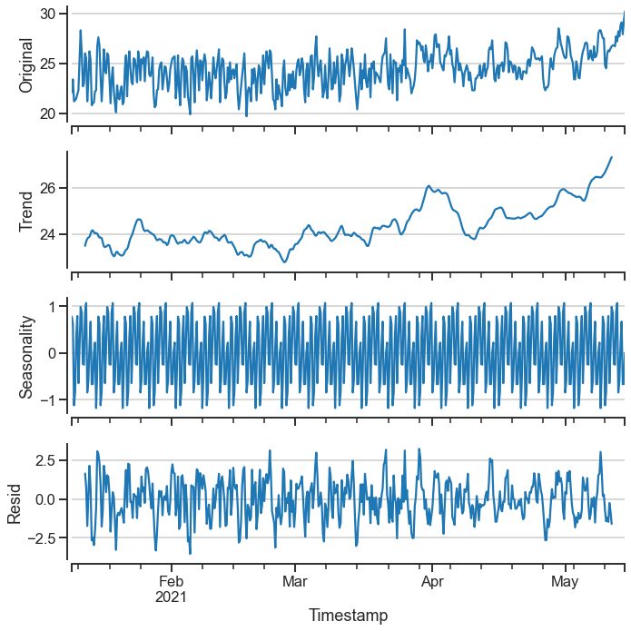
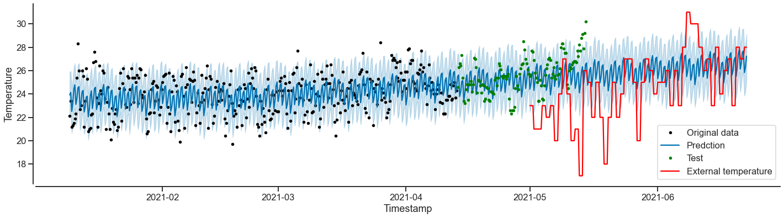

# Model Report

The predction library used was [Prophet](https://facebook.github.io/prophet/) from Meta (Facebook).

It was used a seasonal decompose approach with an additive parameter.

 

<!-- 

 -->

The samples trend was clearly ascending over the time. The original dataset has not seasonality, then after processing data it was created a seasonality with the mean of temperatures generated on the six hour interval. The residual is in accordance with the additive parameter inetrval chosen on the decompose process.

 

The result of Prophet's prediction was very satisfactory. The model learned very well and the forecast result was near the real value and temperature trend in Japan on the time period. The prediction followed the season transition from Winter to Spring showing the possible temperature variation inside the room. If the External temperature red line was fitted in the Prediction blue line it would be seen a similar line. It was also conclusive that prediction parameters, for example, the Y Hats were inside the real temperature average on the same period. Taking in consideration that the red line is the outside temperature without any kind of equipment to regulate it, this can also affirm the positive result for this prediction.
